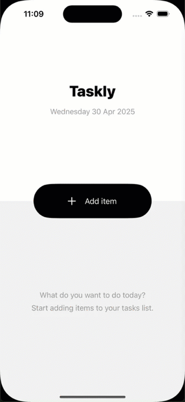

# Taskly

A minimal Task Manager app built with [The Composable Architecture (TCA)](https://github.com/pointfreeco/swift-composable-architecture) and SwiftUI.

## Overview
Taskly allows users to manage a list of tasks, each with its own editable state. The project demonstrates modern TCA patterns, parent-child feature composition, dependency injection, optimistic UI, and integration of analytics and sync clients.

  
   

---

## Features
- **Tasks List Screen**
  - Display a list of tasks
  - Create a new task
  - Complete a task
  - Delete a task
  - Navigate to task details
- **Task Detail Screen**
  - Edit task title
  - Toggle completion
- **Sync Client**
  - Simulates backend sync with artificial delay and debouncing
  - Handles success/failure and allows retries
  - Optimistic UI: updates are shown immediately, errors handled gracefully
- **Analytics Client**
  - Logs analytic events for key user actions
  - Batching and debouncing of events
  - Flushes events when app goes to background
- **UI & Animations**
  - Modern SwiftUI interface with smooth animations and transitions for task actions, list changes, and state updates
  - UI inspired by [Todo app concept on Dribbble](https://dribbble.com/shots/3837693-Todo-app-concept)
- **Unit Testing**
  - Exhaustive tests for TCA features and clients using TestStore and dependency injection

---

## Architecture
- **TCA**: All business logic is implemented using The Composable Architecture.
- **Dependency Injection**: All clients (Sync, Analytics, File) are injected via TCA's DependencyValues.
- **SwiftUI**: Modern, clean UI with state driven by TCA, including animated transitions.
- **Optimistic UI**: State updates immediately, with error handling and retry for sync failures.

---

## Setup & Run
1. **Clone the repository**
2. Open `Taskly.xcodeproj` in Xcode 15+
3. Build and run on iOS Simulator (iOS 18+ recommended)

---

## Assignment Requirements Checklist
- [x] Tasks List: list, create, complete, delete, navigate to details
- [x] Task Detail: edit title, toggle completion
- [x] Sync Client: artificial delay, debouncing, optimistic UI, error handling, retry
- [x] Analytics Client: batching, debouncing, flush on background
- [x] Unit tests: exhaustive for features and clients
- [x] Modern TCA architecture, DI, clean code
- [x] UI with animations and transitions, inspired by [Todo app concept on Dribbble](https://dribbble.com/shots/3837693-Todo-app-concept)

---

## Notes
- No real backend or persistence: all data is stored locally in memory or via FileClient.
- No UI polish: focus is on business logic and architecture, but UI includes meaningful animations and transitions.
- All code and comments are in English.

---

## Author
Anton Nechaiuk

---

If you have any questions or need clarifications, feel free to reach out!
